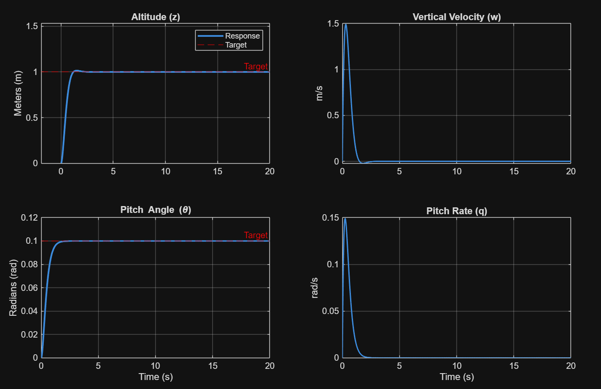
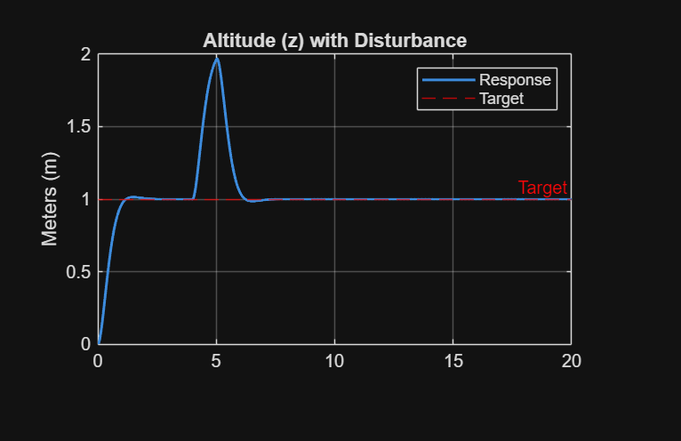

# Quadrotor UAV State Space Control & Sensor Delay Analysis

A MATLAB-based control systems project implementing full state feedback control for a quadrotor UAV, including reference tracking, disturbance rejection, and sensor delay sensitivity analysis.

###### This project serves as the foundation for building a 6 DOF UAV with all the real life effects like noise, sensor delay, and actuator limits.
---

## Project Overview

This project models a quadrotor drone as a **linearized state space system** around hover equilibrium. A decoupled pole placement controller is designed to stabilize altitude and pitch, with feedforward reference tracking. The effect of sensor delay on system performance is then studied systematically.

---

## System Model

### State Vector
```
x = [z, ż, θ, q]
```
| State | Symbol | Description |
|-------|--------|-------------|
| Altitude | z | Vertical position (m) |
| Vertical velocity | ż (w) | Rate of change of altitude (m/s) |
| Pitch angle | θ | Nose tilt angle (rad) |
| Pitch rate | q | Rate of change of pitch (rad/s) |

### Assumptions
- Linearized around **hover equilibrium** (θ = 0, T₀ = mg)
- Roll (φ) and yaw (ψ) are held constant — decoupled
- Small angle approximation: cos(θ) ≈ 1, sin(θ) ≈ 0
- **-g cancels with equilibrium thrust** in the linearized model

### State Space Matrices
```
A = [0  1  0  0]       B = [0      0   ]
    [0  0  0  0]           [1/m    0   ]
    [0  0  0  1]           [0      0   ]
    [0  0  0  0]           [0    1/Iyy ]
```

### Physical Parameters
| Parameter | Value |
|-----------|-------|
| Mass (m) | 0.5 kg |
| Pitch Moment of Inertia (Iyy) | 0.1 kg·m² |

---

## Controllability & Observability

- **Controllability**: Verified using `ctrb(A, B)` — rank = 4 
- **Observability**: Verified using `obsv(A, C)` — rank = 4 
- **C = I₄** (all states are measured)
- **D = 0** (no direct feedthrough)

---

## Controller Design

### Approach: Decoupled Pole Placement

Since altitude and pitch subsystems are **naturally decoupled**, two separate 2×2 controllers are designed:

#### Altitude Subsystem (z, ż)
```matlab
A1 = [0 1; 0 0];   B1 = [0; 1/m];
poles1 = [-2.5+1.5j, -2.5-1.5j];
K1 = place(A1, B1, poles1);
```

#### Pitch Subsystem (θ, q)
```matlab
A2 = [0 1; 0 0];   B2 = [0; 1/Iyy];
poles2 = [-3.0, -3.1];
K2 = place(A2, B2, poles2);
```

#### Full Decoupled Gain Matrix
```
K = [K1(1)  K1(2)    0      0  ]
    [  0      0    K2(1)  K2(2) ]
```

### Design Requirements
| Requirement | Target | Method |
|-------------|--------|--------|
| Overshoot | < 10% | Damping ratio ζ ≈ 0.85 |
| Rise time | < 2 s | Natural frequency ωₙ = 3 |
| Settling time | < 10 s | Poles in left half plane |
| Steady-state error | < 2% | Feedforward gain Kd |

---

## Reference Tracking

### Problem
Pure feedback stabilizes around **x = 0** (ground). To move to a desired state xd, a **feedforward gain Kd** is needed.

### Control Law
```
U = -K(xo - xd) + Kd * xd_red
```

### Feedforward Gain
```matlab
A_cl   = A - B * K_decoupled;
sys_cl = ss(A_cl, B, C, D);
dc     = dcgain(sys_cl);
Kd     = inv(dc([1, 3], :));   % extract z and θ rows
```

### Tracking System
```matlab
sys_tracking = ss(A_cl, B*Kd, C, D);
```

---

## Simulation

### Part A — Reference Tracking
Simulates a drone moving from the origin to the desired state:
```matlab
xd = [1; 0; 0.1; 0];       % z = 1m, theta = 0.1 rad
xo = [0; 0; 0; 0];         % starting at rest
```
### Target Tracking

---
### Part B — Disturbance Rejection
Injects a disturbance between t = 4s and t = 5s to test robustness:
```matlab
dist_accel(t >= 4 & t <= 5) = 0.5;
```
### Disturbance Rejection

---

## Sensor Delay Analysis

Models real-world sensor latency using **Pade approximation** of e^(-τs):

```matlab
delays = 0 : 0.2 : 1.0;    % 0ms to 1000ms
[num, den] = pade(tau, 2);
delay_mimo = tf(num, den) * eye(4);
sys_delayed = delay_mimo * sys_tracking;
```

### Expected Observations
| Delay | Effect |
|-------|--------|
| 0 ms | Clean response, meets all requirements |
| 100–300 ms | Slight oscillations, still stable |
| 300–600 ms | Increased oscillations, may violate requirements |
| 600 ms+ | System may become unstable |

---

## Code Structure

```
quadrotor_control.m
│
├── System Definition          → A, B, C, D matrices
├── Controllability Check      → ctrb()
├── Observability Check        → obsv()
├── Open Loop Analysis         → damp(A)
├── Controller Design          → place(), K_decoupled
├── Tracking Controller        → dcgain(), Kd
├── Simulation Part A          → lsim(), reference tracking
├── Simulation Part B          → lsim(), disturbance rejection
└── Sensor Delay Study         → pade(), delay sensitivity loop
```

---

## Requirements

- MATLAB R2020b or later
- Control System Toolbox

---

## Performance Verification

Performance is extracted using `stepinfo()` on simulation output:

```matlab
s_info = stepinfo(y_sim(:,1), t_sim, xd_red(1));
% Checks: Overshoot, RiseTime, SettlingTime, Peak
```

---

## Key Concepts

| Concept | Role in Project |
|---------|----------------|
| Linearization | Simplifies nonlinear drone dynamics around hover |
| Pole Placement | Places closed loop poles for desired transient response |
| Decoupled Control | Treats altitude and pitch as independent subsystems |
| Feedforward (Kd) | Ensures drone reaches desired position, not just stabilizes |
| Padé Approximation | Models sensor time delay as a rational transfer function |
| Disturbance Rejection | Tests robustness of controller against external forces |

## Key Insights

- Sensor Delay significantly degrades the stability of the system, even when the poles are well placed.
- A decoupled system may make the system simple, but it does not capture the real-life coupled effects.
- The system becomes oscillatory beyond 200ms, which shows how sensitive the system is to the latency.

## Technical Report

A detailed report including system modeling, controller design, and delay analysis is available here:

[Download Report](docs/Quadrotor_Control_Report.docx)
